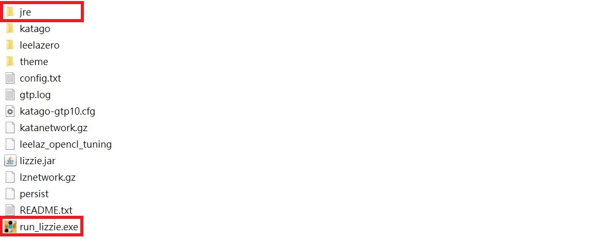

# run_lizzie.exe

## 🧩 Description

This `.exe` file is designed to simplify the process of launching Lizzie.  
Just double-click `run_lizzie.exe` and Lizzie will start automatically.  
It uses the Java Runtime in the `jre` folder to run `lizzie.jar`, so **no additional software installation is required**.

---

## 🚀 How to Use

Please download the following `.zip` files:

1. `run_lizzie.zip` (this folder)
2. [`Lizzie.0.7.4.Windows.x64.GPU.zip`](https://github.com/featurecat/lizzie/releases/download/0.7.4/Lizzie.0.7.4.Windows.x64.GPU.zip)
3. `OpenJDK21U-jre_x64_windows_hotspot_xx.x.x_x.zip`  
   – Download from [https://adoptium.net/temurin/releases/](https://adoptium.net/temurin/releases/) (Windows version, JRE `.zip`)
   

### 🛠 Steps

**Step 1:**  
Extract all `.zip` files.  
Then rename the extracted `OpenJDK21U-jre_x64_windows_hotspot_xx.x.x_x` folder to `jre`.

**Step 2:**  
Place `run_lizzie.exe` and the renamed `jre` folder into the extracted `Lizzie.0.7.4.Windows.x64.GPU` folder.

**Step 3:**  
Double-click `run_lizzie.exe` to start Lizzie.

---

## ⚠️ If `run_lizzie.exe` Was Quarantined by Windows Defender

In rare cases, Windows Defender may falsely detect and quarantine `run_lizzie.exe`. If that happens, follow these steps to restore it:

### 🔄 How to Restore the File

1. Open **Windows Security**  
   – You can find it by searching "Windows Security" in the Start Menu.
2. Go to **Virus & threat protection**
3. Scroll down and click **Protection history**
4. Find the recent alert related to `run_lizzie.exe`  
   – It may say something like *"Severe threat detected"*.
5. Click on the item, then choose **"Actions" → "Restore"**
6. After restoring, try running the `.exe` again.

> ✅ This file has **no malicious behavior**. It is only being blocked because it's a custom-made launcher built with PyInstaller and is unsigned.

---

### Notes:
- This launcher does not include Lizzie itself.
- No modifications have been made to Lizzie.

### Icon Credit:
The icon used in this launcher is from the original Lizzie project and is licensed under the MIT License.
See LICENSE file for details.

### About Lizzie:
Lizzie is an open-source Go (Baduk/Weiqi) analysis GUI, developed by Featurecat.
It is released under the MIT License. For more details, visit the official GitHub page:
https://github.com/featurecat/lizzie

## 📄 License

This project includes open-source code from the [Lizzie project](https://github.com/featurecat/lizzie),  
which is licensed under the **MIT License**.
