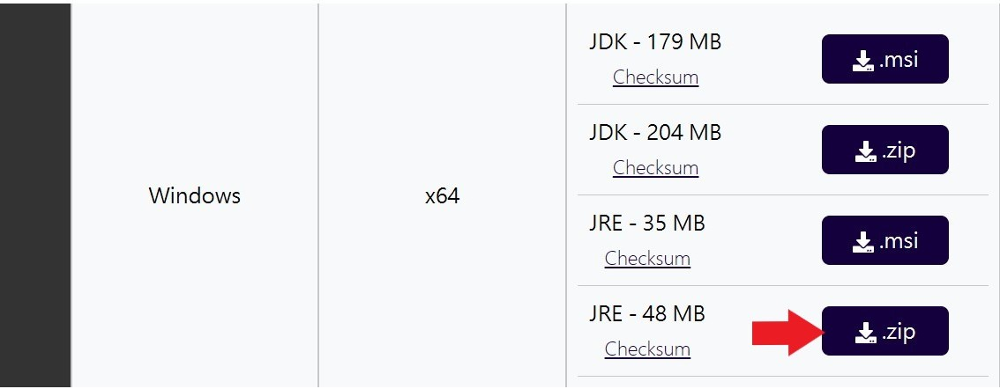
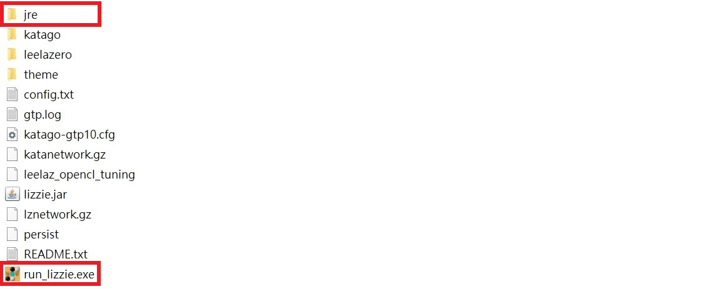

# run_lizzie.exe

## 🧩 描述

這個 `.exe` 檔案旨在簡化啟動 Lizzie 的過程。  
只需雙擊 `run_lizzie.exe`，Lizzie 就會自動啟動。  
它使用 `jre` 資料夾中的 Java 執行環境來運行 `lizzie.jar`，因此 **不需要額外安裝軟體**。

---

## 🚀 使用方法

請下載以下 `.zip` 檔案：

1. `run_lizzie.zip`（此資料夾）
2. [`Lizzie.0.7.4.Windows.x64.GPU.zip`](https://github.com/featurecat/lizzie/releases/download/0.7.4/Lizzie.0.7.4.Windows.x64.GPU.zip)
3. `OpenJDK21U-jre_x64_windows_hotspot_xx.x.x_x.zip`  
   – 從 [https://adoptium.net/temurin/releases/](https://adoptium.net/temurin/releases/) 下載（Windows 版本，JRE `.zip`）  
   

### 🛠 步驟

**步驟 1：**  
解壓所有 `.zip` 檔案。  
然後將解壓縮後的 `OpenJDK21U-jre_x64_windows_hotspot_xx.x.x_x` 資料夾重命名為 `jre`。

**步驟 2：**  
將 `run_lizzie.exe` 和重新命名的 `jre` 資料夾放入解壓後的 `Lizzie.0.7.4.Windows.x64.GPU` 資料夾中。  

**步驟 3：**  
雙擊 `run_lizzie.exe` 來啟動 Lizzie。

---

## ⚠️ 如果 `run_lizzie.exe` 被 Windows Defender 隔離

在少數情況下，Windows Defender 可能會錯誤地檢測並隔離 `run_lizzie.exe`。如果發生這種情況，請按照以下步驟恢復檔案：

### 🔄 如何恢復檔案

1. 打開 **Windows 安全性**  
   – 可以在開始菜單中搜尋 "Windows 安全性"。
2. 進入 **病毒與威脅防護**
3. 向下滾動並點擊 **保護歷史記錄**
4. 找到最近與 `run_lizzie.exe` 相關的警報  
   – 可能會顯示 *“檢測到嚴重威脅”* 等訊息。
5. 點擊該項目，然後選擇 **"動作" → "恢復"**
6. 恢復後，再次嘗試運行 `.exe` 檔案。

> ✅ 此檔案 **無任何惡意行為**。它之所以被阻擋，是因為它是一個自製的啟動器，使用 PyInstaller 製作，並且未簽名。

---

### 備註：
- 這個啟動器不包含 Lizzie 本身。
- 未對 Lizzie 進行任何修改。

### 圖示來源：
此啟動器所使用的圖示來自原始的 Lizzie 專案，並根據 MIT 許可證進行授權。詳細資訊請參見 LICENSE 檔案。

### 關於 Lizzie：
Lizzie 是一個開源的圍棋（Baduk/Weiqi）分析圖形介面，由 Featurecat 開發。  
它根據 MIT 許可證釋出。更多詳情，請訪問官方 GitHub 頁面：  
https://github.com/featurecat/lizzie

## 📄 許可證

此專案包含來自 [Lizzie 專案](https://github.com/featurecat/lizzie) 的開源程式碼，  
其根據 **MIT 許可證** 進行授權。
